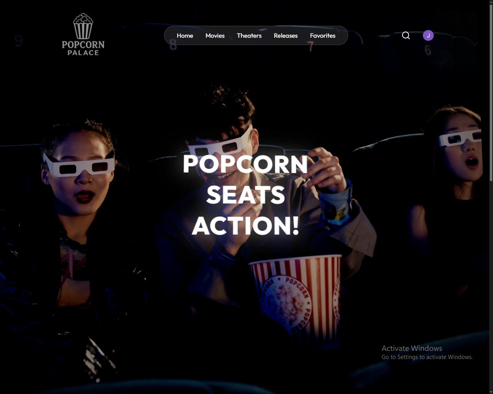
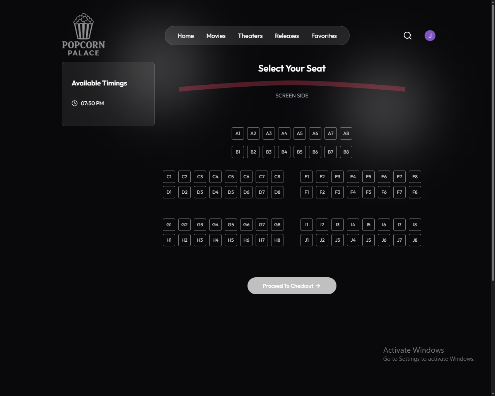
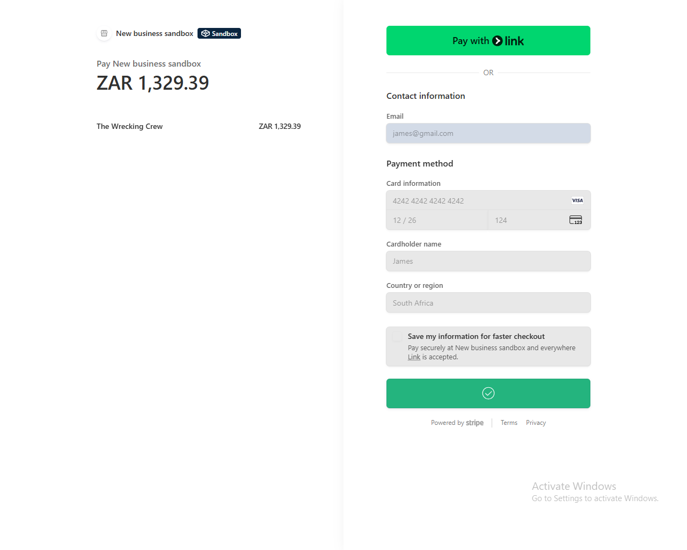
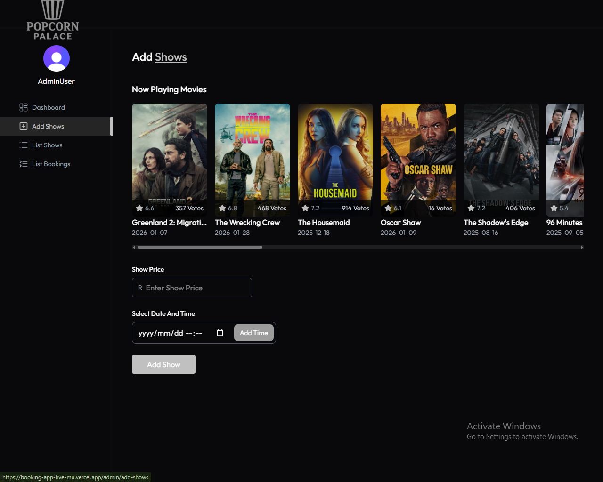

# 🎬 Popcorn Palace

<p align="center">
  
</p>

<h3 align="center">
Production-Style Movie Ticket Booking Platform
</h3>

<p align="center">
A full-stack booking platform built with React, Node.js, Express, MongoDB, Stripe, Clerk, and Inngest.
</p>

<p align="center">

<a href="https://booking-app-five-mu.vercel.app">

</a>


</p>

---

# 📑 Table of Contents

- [Live Demo](#-live-demo)
- [Overview](#-overview)
- [Why I Built This](#-why-i-built-this)
- [Features](#-features)
- [Technology Stack](#-technology-stack)
- [Application Preview](#-application-preview)
- [System Architecture](#-system-architecture)
- [Booking Workflow](#-booking-workflow)
- [Engineering Decisions](#-engineering-decisions)
- [Concurrency Handling](#-concurrency-handling)
- [Testing](#-testing)
- [Project Structure](#-project-structure)
- [Installation](#-installation)
- [Environment Variables](#-environment-variables)
- [Running Locally](#-running-locally)
- [Engineering Challenges](#-engineering-challenges)
- [Lessons Learned](#-lessons-learned)
- [Future Improvements](#-future-improvements)

---

# 🚀 Live Demo

### 🌐 Frontend

https://booking-app-five-mu.vercel.app

---

# 📖 Overview

Popcorn Palace is a production-style movie ticket booking platform designed to simulate the challenges of building a real-world reservation system.

The application allows users to browse movies, select seats, complete secure payments, and receive booking confirmations while maintaining consistent seat availability across concurrent users.

Rather than focusing solely on CRUD operations, this project explores backend engineering concepts such as concurrency control, payment workflows, authentication, asynchronous event processing, and scalable application architecture.

---

# 🎯 Why I Built This

Movie booking platforms introduce several engineering challenges beyond displaying data on a screen.

I wanted to build a system capable of handling situations such as:

- Multiple users selecting the same seats simultaneously
- Secure payment processing
- Reliable booking confirmation workflows
- Protected administration features
- Background event processing

This project gave me practical experience designing systems that prioritize correctness, reliability, and user experience.

---

# ✨ Features

## 🎬 Movie Discovery

- Browse movies
- View movie details
- Explore available showtimes

---

## 🎟️ Seat Booking

- Interactive seat selection
- Live seat availability
- Backend booking validation
- Prevents duplicate reservations
- Supports concurrent users

---

## 💳 Secure Payments

- Stripe Checkout integration
- Secure payment workflow
- Booking confirmation after successful payment

---

## 🔐 Authentication

- Clerk authentication
- Protected routes
- Role-based authorization
- Secure user sessions

---

## ⚡ Event-Driven Workflows

- Automated booking confirmation
- Background event processing
- Reliable asynchronous workflows using Inngest

---

## 🛠️ Admin Dashboard

- Create movies
- Update showtimes
- Monitor bookings
- Manage platform content

---

# ⚡ Technology Stack

| Layer | Technology |
|--------|------------|
| Frontend | React |
| Backend | Node.js |
| Framework | Express.js |
| Database | MongoDB |
| Authentication | Clerk |
| Payments | Stripe |
| Background Jobs | Inngest |
| Hosting | Vercel |

---

# 📸 Application Preview

## 🏠 Landing Page


---

## 🎟️ Seat Selection



---

## 💳 Checkout



---

## 🛠️ Admin Dashboard



---

# 🏗️ System Architecture

```text
                  Browser
                      │
                      ▼
             React Frontend
                      │
═══════════════════════════════════
             Express API
═══════════════════════════════════
      │            │            │
      ▼            ▼            ▼
 MongoDB       Stripe       Inngest
 Database      Payments     Events
      │                         │
      └──────────────┬──────────┘
                     ▼
            Booking Confirmation
```

The backend acts as the central coordinator, validating bookings, processing payments, persisting data, and triggering asynchronous workflows while maintaining consistent booking state.

---

# 🔄 Booking Workflow

1. User signs in using Clerk.
2. User selects a movie and showtime.
3. Available seats are displayed.
4. User selects seats.
5. Backend validates seat availability.
6. Stripe securely processes payment.
7. Booking is stored in MongoDB.
8. Inngest triggers background workflows.
9. Confirmation is delivered to the user.

---

# 🏛️ Engineering Decisions

## Why Clerk?

Authentication is delegated to Clerk to provide secure session management, user authentication, and role-based access control without implementing authentication from scratch.

---

## Why Stripe?

Stripe provides secure payment processing, PCI compliance, and reliable checkout workflows while reducing the complexity of handling payment infrastructure.

---

## Why Inngest?

Background tasks such as booking confirmations should not delay HTTP responses.

Using Inngest allows asynchronous workflows to execute independently while keeping the application responsive.

---

## Why MongoDB?

MongoDB's flexible document model makes it well suited for storing movies, users, bookings, and showtimes while allowing the schema to evolve as the application grows.

---

# 🔒 Concurrency Handling

One of the most important engineering challenges in booking systems is preventing multiple users from reserving the same seat simultaneously.

To maintain consistency, the backend validates seat availability before confirming each reservation.

Current implementation:

- Backend validation before booking confirmation
- Prevents duplicate reservations
- Maintains consistent booking state
- Protects against conflicting user actions

Future improvements include distributed locking and temporary seat reservations.

---

# 🧪 Testing

The application was manually tested across multiple scenarios including:

- User authentication
- Payment processing
- Booking workflow
- Concurrent booking attempts
- Admin functionality
- Protected routes
- Cross-browser compatibility
- Responsive layouts

---

# 📡 API Overview

| Method | Endpoint | Purpose |
|---------|----------|---------|
| GET | /movies | Retrieve movies |
| GET | /shows | Retrieve showtimes |
| POST | /bookings | Create booking |
| POST | /payments | Process payment |
| GET | /admin | Admin management |

---

# 🎓 Skills Demonstrated

- React Development
- Node.js
- Express.js
- MongoDB
- Clerk Authentication
- Stripe Integration
- Inngest Workflows
- REST API Development
- Backend Architecture
- Event-Driven Systems
- Payment Processing
- Concurrency Handling
- Production Deployment
- Full-Stack Development

---

# 📂 Project Structure

```text
booking-app
│
├── client/
│   ├── components/
│   ├── pages/
│   ├── hooks/
│   ├── services/
│   └── assets/
│
├── server/
│   ├── controllers/
│   ├── middleware/
│   ├── routes/
│   ├── models/
│   ├── config/
│   └── services/
│
└── README.md
```

---

# ⚙️ Installation

## Clone Repository

```bash
git clone https://github.com/coffee-driven-dev007/booking-app.git
```

---

## Navigate into the project

```bash
cd booking-app
```

---

## Install Frontend

```bash
cd client
npm install
```

---

## Install Backend

```bash
cd ../server
npm install
```

---

# 🔐 Environment Variables

## Server

```env
MONGO_URI=your_mongodb_connection

CLERK_SECRET_KEY=your_clerk_secret

STRIPE_SECRET_KEY=your_stripe_secret

INNGEST_EVENT_KEY=your_inngest_key

JWT_SECRET=your_secret_key
```

---

# ▶️ Running Locally

## Start Backend

```bash
cd server
npm run dev
```

---

## Start Frontend

```bash
cd client
npm start
```

---

# 🚧 Engineering Challenges

## Booking Consistency

Designed backend validation to maintain consistent seat availability under concurrent booking attempts.

---

## Payment Integration

Integrated Stripe to securely process transactions while ensuring bookings are only confirmed after successful payment.

---

## Event Processing

Implemented asynchronous workflows with Inngest to handle booking confirmations independently from the main request cycle.

---

## Authentication

Implemented Clerk authentication with protected routes and role-based authorization for administrative features.

---

## Full-Stack Integration

Coordinated communication between React, Express, MongoDB, Stripe, Clerk, and Inngest to deliver a cohesive booking experience.

---

# 💡 Lessons Learned

Building this project reinforced several important software engineering principles:

- Backend validation is essential when multiple users interact simultaneously.
- Payment workflows must account for partial failures and recovery.
- Authentication should be secure, maintainable, and delegated when appropriate.
- Event-driven architecture improves responsiveness by moving background work out of the request lifecycle.
- Designing reliable systems requires thinking beyond individual features.

---

# 🚀 Future Improvements

## High Priority

- Real-time seat synchronization using WebSockets
- Temporary seat reservations
- Booking timeout with automatic seat release
- Booking history dashboard

---

## Medium Priority

- QR code ticket validation
- Email ticket delivery
- Movie recommendations
- Search and filtering

---

## Long-Term

- Redis distributed locking
- Horizontal scaling
- Docker deployment
- AWS cloud deployment
- Monitoring and observability
- Automated integration testing

---

# 👨‍💻 Author

## James Matsheni

Full-Stack Developer focused on backend systems, real-time applications, and scalable software architecture.

**GitHub**

https://github.com/coffee-driven-dev007

**Portfolio**

https://portfolio-beta-drab-76.vercel.app

---

# ⭐ Support

If you found this project interesting, consider giving it a ⭐ on GitHub.

It helps increase the visibility of the repository and supports future development.

---

# 📄 License

This project is licensed under the MIT License.

---

<p align="center">

Built with ❤️ by <strong>James Matsheni</strong>

<strong>Building scalable backend systems, reliable payment platforms, and real-time applications with modern JavaScript technologies.</strong>

</p>
